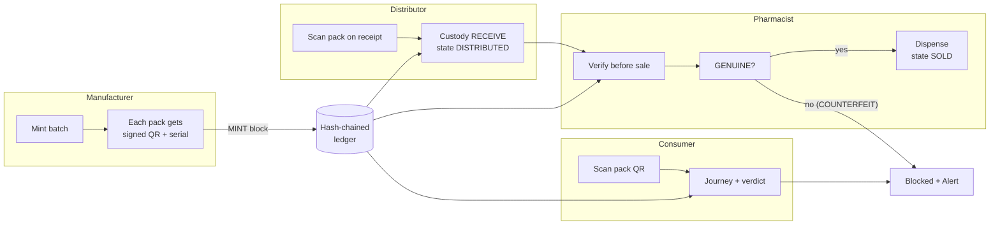
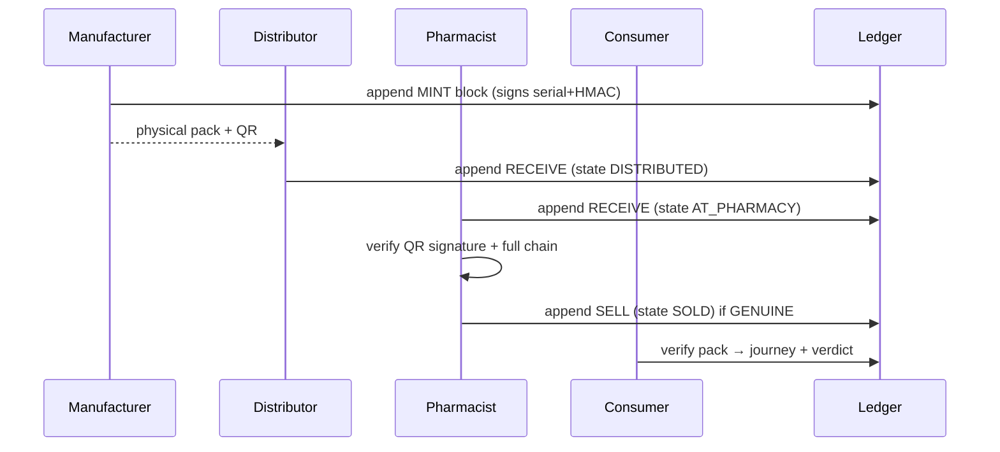
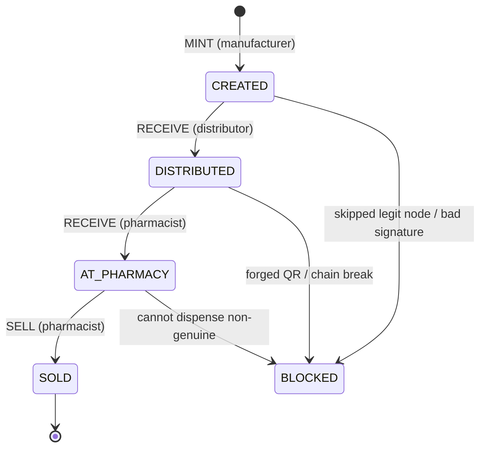
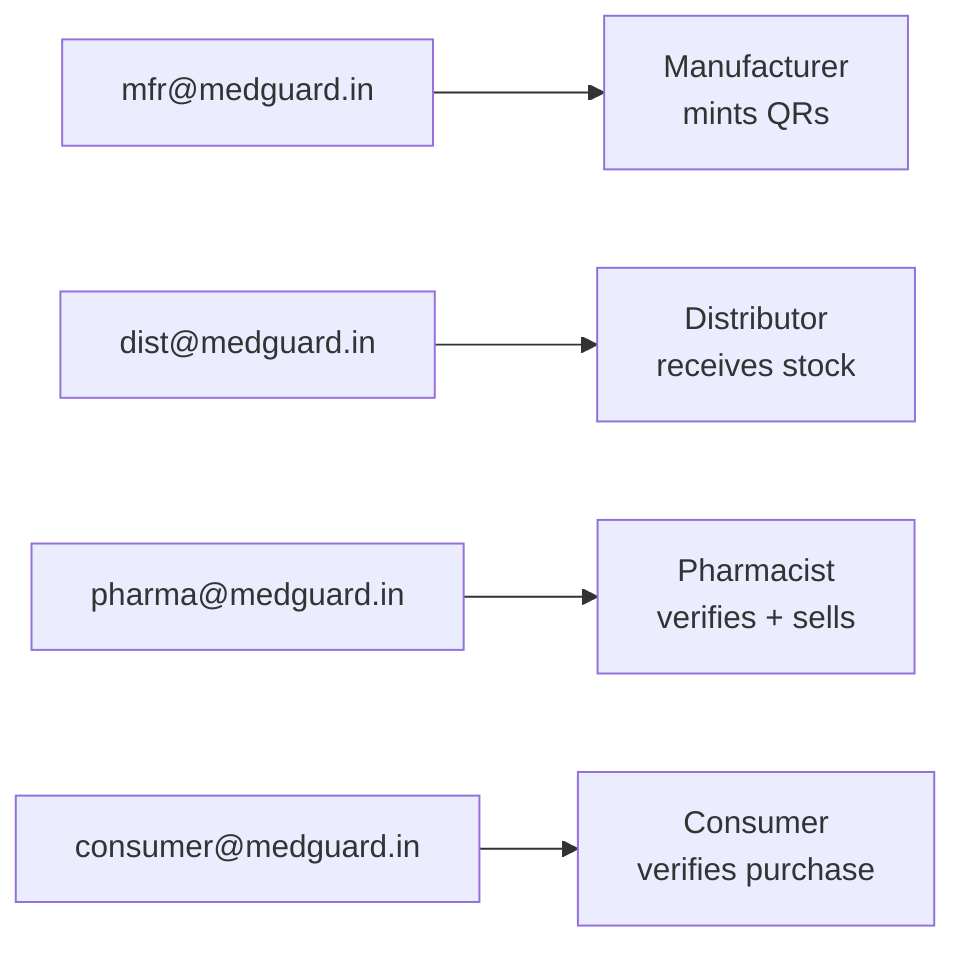
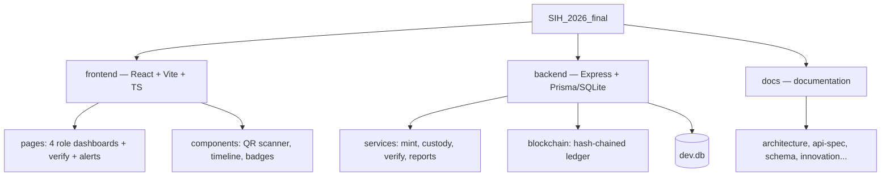

# MedGuard — Counterfeit Medicine Detection (SIH 2026, PS #59)

QR/on-chain verification at the pharmacy level. Every medicine pack gets a **signed QR**; every
handoff (manufacturer → distributor → pharmacist → consumer) is recorded on an **immutable
hash-chained ledger**. A counterfeit — one that was never minted, a copied QR, or a chain that
skipped a legit node — fails verification at the pharmacy.

## How it works





## Product state machine



## Verification rules

```mermaid
flowchart TD
    Q[Scan QR] --> P1{Valid MEDG format?}
    P1 -- no --> F1[COUNTERFEIT<br/>unparseable]
    P1 -- yes --> P2{Serial minted?}
    P2 -- no --> F2[COUNTERFEIT<br/>not_minted]
    P2 -- yes -->     P3 {Signature valid?<br/>Ed25519 or legacy HMAC}
    P3 -- no --> F3[COUNTERFEIT<br/>bad_signature]
    P3 -- yes --> P4{Custody chain intact?}
    P4 -- no --> F4[COUNTERFEIT<br/>chain_broken]
    P4 -- yes --> P5{Scanned after sale?}
    P5 -- yes --> F5[SUSPICIOUS<br/>scanned_after_sold]
    P5 -- no --> P6{Scan location matches route?}
    P6 -- no --> F6[SUSPICIOUS<br/>route_mismatch]
    P6 -- yes --> P7{Too many scans?}
    P7 -- yes --> F7[SUSPICIOUS<br/>scan_flood]
    P7 -- no --> OK[GENUINE ✓]
```

## Run it

```bash
npm run setup     # install all, create DB, seed demo users + batch
npm run dev       # backend :4000 + frontend :5173
npm run selfcheck # assert ledger hash-chain integrity
```

Seed logins (password `demo1234`):



| Role | Email | Home route |
|---|---|---|
| Manufacturer | mfr@medguard.in | /manufacturer |
| Distributor | dist@medguard.in | /distributor |
| Pharmacist | pharma@medguard.in | /pharmacist |
| Consumer | consumer@medguard.in | /consumer |

## Project structure



Full docs live in [`docs/`](docs/). Start with [`docs/architecture.md`](docs/architecture.md),
then [`docs/innovation.md`](docs/innovation.md) for the pitch, and
[`docs/presentation/demo-script.md`](docs/presentation/demo-script.md) for the walkthrough.
For how we handle dropped networks and tampered chains, see
[`docs/robustness.md`](docs/robustness.md).
