# ORVYN — Counterfeit Medicine Detection & Context-Aware Pharmaceutical Trust System

> **SIH 2026, PS #59**

ORVYN is a counterfeit medicine detection and authenticity verification system designed around a simple principle:

> **A medicine should not be considered genuine merely because its QR code exists.**

Every medicine pack receives a **unique serial identity and cryptographically signed QR code**. Its journey through the supply chain is recorded through an **append-only, tamper-evident hash-chained custody ledger**.

ORVYN verifies not only whether a medicine identity exists, but also:

* whether the identity was legitimately minted,
* whether its cryptographic signature is valid,
* whether its custody history is intact,
* whether each state transition is valid,
* whether the medicine has already been sold,
* whether its scan location is consistent with its expected route,
* whether its identity is being scanned abnormally,
* and whether the overall behaviour suggests cloning, replay, tampering, or counterfeit activity.

A counterfeit or suspicious medicine may therefore be detected because it was:

* never minted,
* assigned a malformed QR,
* given a forged or invalid signature,
* associated with a broken or tampered custody chain,
* moved through an invalid supply-chain transition,
* scanned after legitimate sale,
* detected in an inconsistent location,
* repeatedly scanned beyond an expected threshold,
* or associated with suspicious behavioural patterns indicating a possible cloned identity.

---

# The Core Shift

Traditional QR verification often asks:

```text
Does this QR code exist?
```

ORVYN asks:

```text
Is this identity legitimate?
        +
Is its recorded history cryptographically consistent?
        +
Does its real-world behaviour make sense?
```

This creates a three-layer trust model:

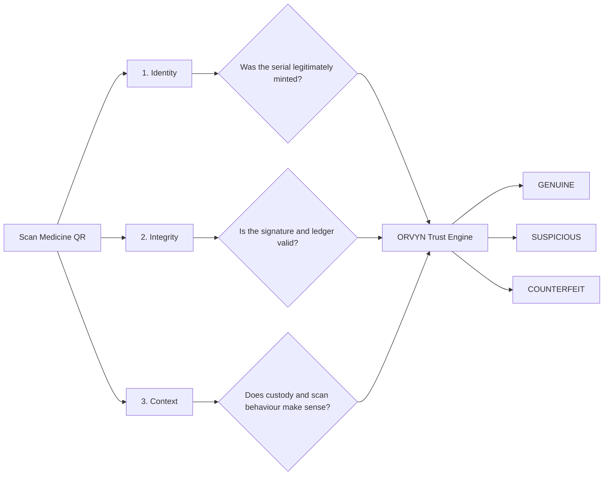

---

# How It Works

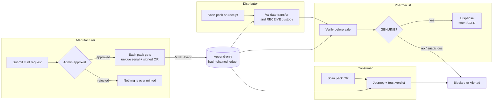

The normal custody journey is:

```text
Manufacturer
      │
      │ MINT
      ▼
CREATED
      │
      │ Valid custody transfer
      ▼
DISTRIBUTOR
      │
      │ RECEIVE
      ▼
DISTRIBUTED
      │
      │ Valid custody transfer
      ▼
PHARMACY
      │
      │ RECEIVE
      ▼
AT_PHARMACY
      │
      │ VERIFY + SELL
      ▼
SOLD
      │
      ▼
CONSUMER
```

Each important transition is validated before it becomes part of the medicine's recorded history.

---

# End-to-End Product Flow

The complete lifecycle, from a manufacturer's mint request to a consumer's purchase, with every gate the system enforces along the way:

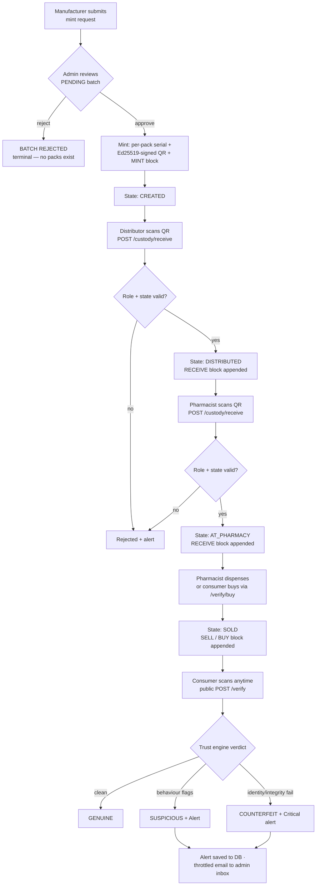

## Mint approval in detail

Minting never happens on the manufacturer's word alone. An admin account must approve each request; only then are packs, signed QRs and `MINT` ledger blocks generated:

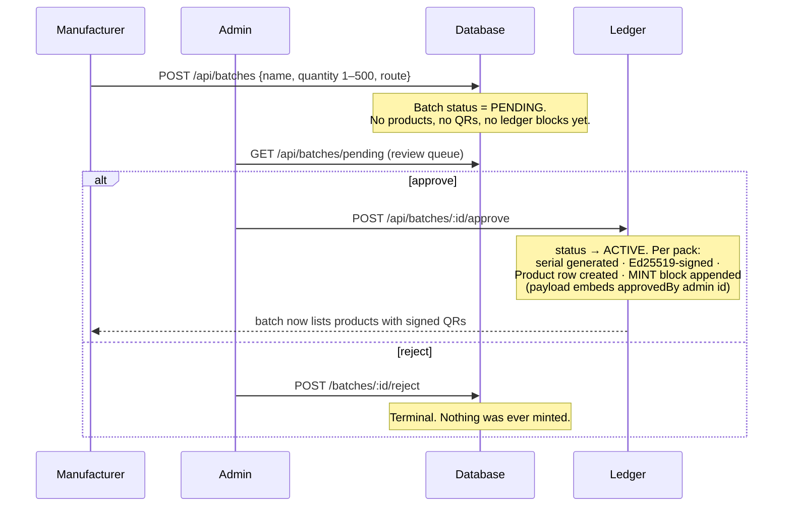

The `approvedBy` field inside every `MINT` payload gives tamper-evident attribution: whoever approved a batch into existence is recorded in the ledger itself, not just in an application table.

---

# Consumer Purchase, AI Assistant & Notifications

Beyond verification, three supporting services close the loop:

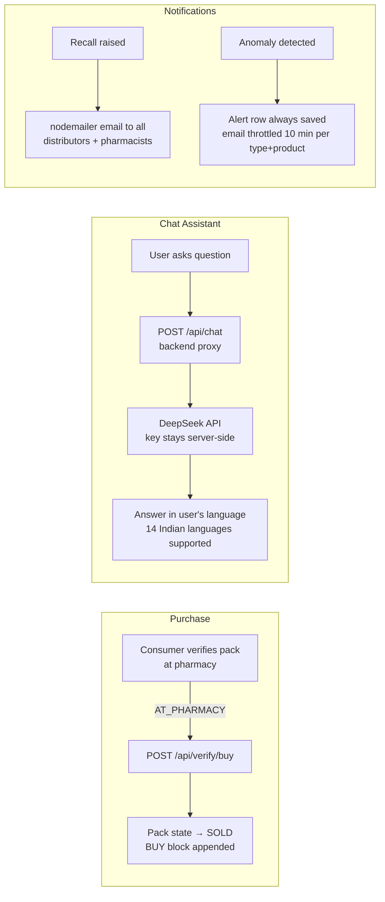

* **Purchase** (`POST /verify/buy`) — a consumer standing at a pharmacy can buy a verified `AT_PHARMACY` pack directly from the public verification page. The purchase appends a `BUY` ledger event and closes the chain as `SOLD`.
* **AI assistant** (`POST /chat`) — the browser only talks to our backend proxy; the DeepSeek API key never leaves the server. The assistant receives the currently scanned pack's verdict, flags and journey as context, answers in the user's language, and follows a safety rule of never issuing definitive medical advice. If no key is configured it degrades gracefully.
* **Notifications** — recalls email every distributor and pharmacist stakeholder (mock preview logged when SMTP is unconfigured, so recall never depends on SMTP). Anomaly alerts are always persisted to the database, but critical ones (`unminted_serial`, `bad_signature`, `unparseable_qr`, `batch_recalled`) additionally trigger throttled emails to the admin inbox so repeated scans of one fake pack don't flood it.

---

# Why a Simple QR System Is Not Enough

A static QR code can be copied.

An attacker could:

```text
1. Obtain one genuine medicine package
                ↓
2. Copy its valid QR identity
                ↓
3. Print the same identity on counterfeit packages
                ↓
4. Distribute multiple physical packages
                ↓
5. Every copied QR points to a genuine database record
```

A naïve system may therefore perform:

```text
Scan QR
   ↓
QR exists?
   ↓
YES
   ↓
"GENUINE"
```

This creates a critical loophole:

> **The QR identity can be genuine while the physical package carrying it may be counterfeit.**

ORVYN addresses this by combining identity verification with cryptographic integrity, custody validation, and behavioural analysis.

---

# Sequence of a Legitimate Medicine Journey

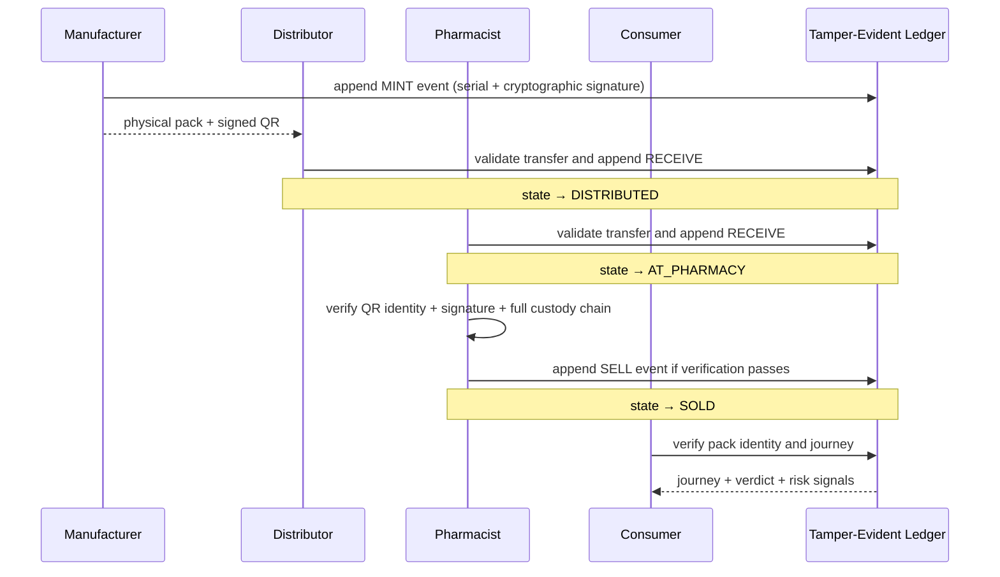

---

# Chain of Custody

ORVYN treats custody as a controlled sequence rather than a freely editable status.

A transfer must be consistent with:

* the current medicine state,
* the current custody holder,
* the expected next participant,
* the authenticated role of the actor,
* and the allowed transition rules.

A simplified transfer model is:

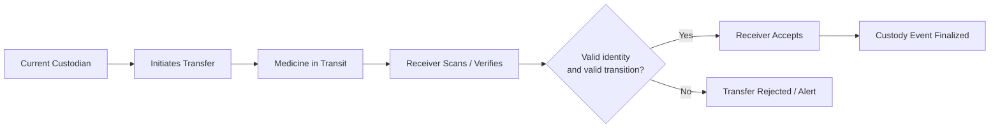

This is stronger than allowing a participant to simply change:

```text
status = "AT_DISTRIBUTOR"
```

without validating whether the previous holder, receiver, and transition are legitimate.

---

# Product State Machine

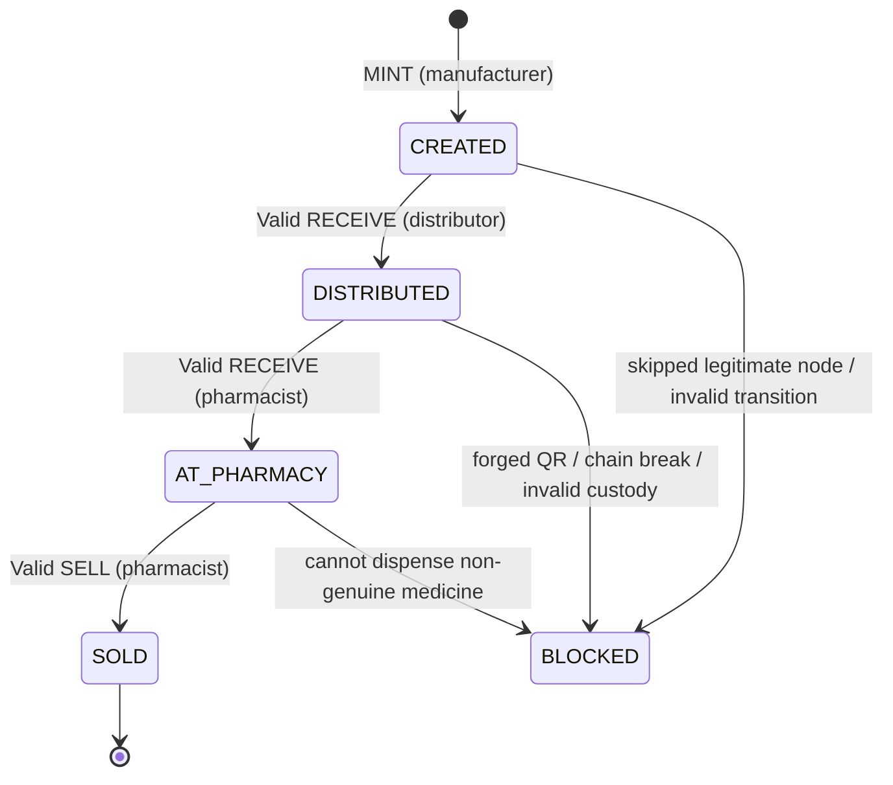

Only valid state transitions are accepted.

For example:

```text
CREATED
   │
   ├── valid → DISTRIBUTED
   │
   └── invalid attempt to skip required custody
                    │
                    ▼
                 BLOCKED
```

The state machine prevents a medicine identity from arbitrarily jumping through the supply chain.

---

# Tamper-Evident Hash-Chained Ledger

Each important event is recorded as part of a hash-linked history.

Conceptually:

```text
EVENT 1 — MINT

Hash: H1


        ↓


EVENT 2 — DISTRIBUTOR RECEIVE

Previous Hash: H1
Hash: H2


        ↓


EVENT 3 — PHARMACY RECEIVE

Previous Hash: H2
Hash: H3


        ↓


EVENT 4 — SELL

Previous Hash: H3
Hash: H4
```

Changing a historical event changes its hash and breaks the relationship with subsequent events.

```text
Original chain:

[MINT H1]
      ↓
[RECEIVE H2 → references H1]
      ↓
[RECEIVE H3 → references H2]


Historical event modified:

[MINT H1' ✏️]
       ↓
❌ H2 no longer matches expected previous hash
       ↓
❌ H3 chain validation fails
```

ORVYN can detect this through ledger integrity verification:

```bash
npm run selfcheck
```

### Important security distinction

A hash chain is **tamper-evident**, not magically immune to every possible attack.

If an attacker gains sufficiently privileged control over the entire persistence layer, they may attempt to rewrite historical records and recompute hashes.

ORVYN therefore strengthens the ledger architecture through mechanisms such as:

* append-only event handling,
* cryptographically signed events,
* periodic integrity checkpoints,
* independent verification,
* controlled write permissions,
* authorization checks before event creation,
* and ledger self-checking.

The goal is not to claim that tampering is impossible under every imaginable compromise.

The goal is to make unauthorized modification **detectable, difficult, and auditable**.

---

# Verification Rules

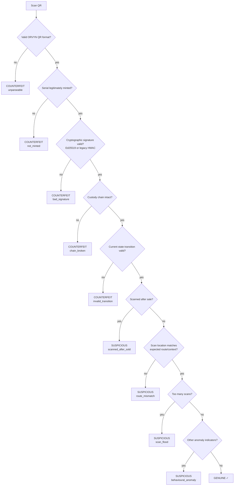

---

# ORVYN Trust Verdicts

ORVYN does not reduce every result to a simplistic `true` or `false`.

## 🟢 GENUINE

The medicine:

* has a valid QR format,
* corresponds to a legitimately minted serial,
* passes signature verification,
* has an intact custody chain,
* follows valid state transitions,
* and does not currently show suspicious contextual behaviour.

Example:

```text
✓ Identity verified
✓ Signature valid
✓ Custody chain intact
✓ Valid pharmacy state
✓ Normal scan behaviour

VERDICT: GENUINE
```

---

## 🟡 SUSPICIOUS

The digital identity may be legitimate, but its real-world behaviour is inconsistent or requires investigation.

Possible reasons:

* scanned after sale,
* repeated scans beyond the expected threshold,
* route or location mismatch,
* unusual custody behaviour,
* anomalous account or transaction activity,
* or other rule-based anomaly indicators.

Example:

```text
✓ Identity exists
✓ Signature valid
✓ Ledger intact

⚠ Same identity scanned unusually frequently
⚠ Activity inconsistent with expected package behaviour

VERDICT: SUSPICIOUS
```

This distinction is particularly important for QR cloning.

A copied QR can still contain a valid cryptographic identity. ORVYN therefore does not falsely assume:

> Valid QR = guaranteed genuine physical medicine.

Instead, it can identify abnormal behaviour associated with possible cloning or misuse.

---

## 🔴 COUNTERFEIT / BLOCKED

The medicine fails a fundamental authenticity or integrity requirement.

Possible reasons include:

* malformed QR,
* serial never minted,
* invalid signature,
* broken custody chain,
* invalid state transition,
* forged identity,
* or detected ledger integrity failure.

Example:

```text
✗ Serial not found in legitimate mint records

VERDICT: COUNTERFEIT
```

---

# QR Clone and Scan Intelligence

A genuine identity may be copied onto multiple counterfeit packages.

ORVYN tracks scan and verification behaviour to identify signals such as:

## Impossible or inconsistent movement

```text
Scan 1
Chennai
10:03 AM

        ↓

Scan 2
Kolkata
10:04 AM

        ↓

⚠ Context inconsistency detected
```

The exact evaluation can consider time, route, expected custody state, and configured contextual rules.

---

## Scan flooding

```text
Expected behaviour:
1 physical package → limited verification activity

Observed:
Same identity → unusually high scan volume

                ↓

⚠ scan_flood
```

Repeated scans do not automatically prove a counterfeit, but they can contribute to a suspicious verdict or risk score.

---

## Scan after sale

```text
Medicine state:

AT_PHARMACY
      ↓
SELL
      ↓
SOLD ✓


Same identity scanned repeatedly in an unexpected context
      ↓
⚠ scanned_after_sold
```

This can indicate identity reuse, cloning, or other abnormal activity.

---

# Context-Aware Verification

ORVYN's verification process operates across three layers.

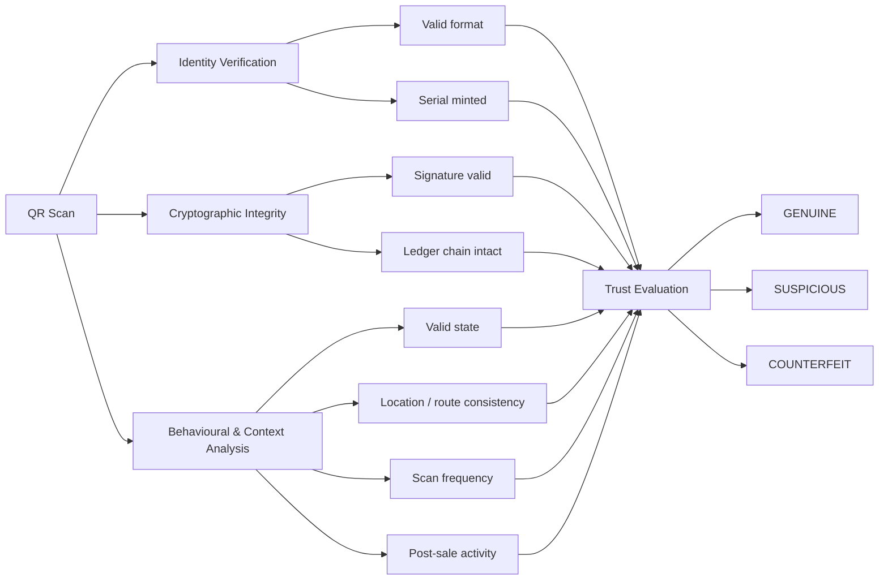

---

# Risk Scoring and Anomaly Detection

ORVYN uses transparent, rule-based anomaly detection to identify suspicious activity without requiring a complex or opaque machine-learning system.

Conceptually:

```text
Valid identity
    + 0

Repeated unusual scans
    + risk

Route inconsistency
    + higher risk

Post-sale activity
    + risk

Invalid custody behaviour
    + higher risk
```

The resulting signals can contribute to a contextual assessment such as:

```text
Risk Score: 80 / 100

Signals:
⚠ Unusual scan frequency
⚠ Location inconsistency

Result:
HIGH-RISK — POSSIBLE CLONED OR MISUSED IDENTITY
```

The rule-based approach keeps the detection logic:

* explainable,
* auditable,
* practical for an MVP,
* and easy to demonstrate during evaluation.

---

# Protection Against Duplicate and Replayed Actions

Real-world systems must handle:

* users clicking the same action multiple times,
* network retries,
* interrupted connections,
* duplicate API requests,
* and malicious replay attempts.

ORVYN therefore treats critical custody events similarly to transactional operations.

Conceptually:

```text
Actor submits custody action
          ↓
Request authenticated
          ↓
Authorization checked
          ↓
State transition validated
          ↓
Duplicate / idempotency check
          ↓
Freshness / replay validation
          ↓
Append exactly one valid event
```

This prevents the same custody action from unintentionally creating multiple independent ledger events.

---

# Security Model

Critical operations are protected through multiple layers rather than trusting a single QR scan or database field.

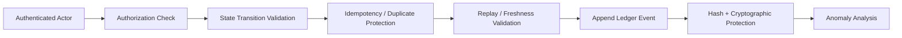

The system uses role-based responsibilities.

| Action                                | Expected Protection                   |
| ------------------------------------- | ------------------------------------- |
| Consumer authenticity check           | Public or minimal verification access |
| Distributor inventory/custody actions | Authenticated distributor role        |
| Pharmacy verification and sale        | Authenticated pharmacist role         |
| Medicine minting                      | Authorized manufacturer role          |
| Administrative permission changes     | Strongly restricted authorization     |

Security is supported through mechanisms including:

* JWT authentication,
* password hashing with bcrypt,
* cryptographic hashing using `node:crypto`,
* cryptographic QR signatures,
* Ed25519 or legacy HMAC verification,
* Helmet,
* CORS controls,
* rate limiting,
* authorization checks,
* state-machine validation,
* idempotency protection,
* replay-aware request handling,
* anomaly detection,
* and tamper-evident ledger verification.

---

# Threat and Loophole Coverage

| Threat / Failure Mode                    | ORVYN Response                          |
| ---------------------------------------- | --------------------------------------- |
| Fake or malformed QR                     | QR format validation                    |
| Random serial number                     | Mint record lookup                      |
| Forged QR identity                       | Cryptographic signature validation      |
| Modified historical event                | Hash-chain integrity verification       |
| Skipped supply-chain node                | Custody and state validation            |
| Invalid participant transition           | Authorization and state-machine checks  |
| Same action submitted twice              | Idempotency / duplicate protection      |
| Replayed critical request                | Freshness and replay validation         |
| QR copied onto fake packages             | Scan and behavioural anomaly detection  |
| Same identity scanned excessively        | Scan flood detection                    |
| Identity appears in inconsistent context | Route / location mismatch detection     |
| Identity reused after sale               | Post-sale scan detection                |
| Privileged or unusual activity           | Rule-based anomaly signals and auditing |
| Ledger corruption or tampering           | Integrity self-check and verification   |

---

# Product Security Philosophy

ORVYN does not rely on a single mechanism.

```text
QR alone
    ❌ Not enough

QR + database lookup
    ❌ Still vulnerable to copied valid identities

Signed QR
    ✓ Stronger identity protection

Signed QR
    +
Tamper-evident custody history
    ✓ Detects invalid or modified journeys

Signed QR
    +
Custody validation
    +
State-machine enforcement
    +
Context-aware scan analysis
    ✓ ORVYN trust model
```

The objective is to create **defence in depth**.

---

# API Surface

Full request/response details: [`docs/api-spec.md`](docs/api-spec.md). Summary:

| Group     | Endpoints                                                                 | Auth              |
| --------- | ------------------------------------------------------------------------- | ----------------- |
| Auth      | `POST /api/auth/register` · `POST /api/auth/login`                        | public            |
| Batches   | `POST /api/batches` · `GET /api/batches` · `GET /api/batches/:id` · `POST /api/batches/:id/approve` · `POST /api/batches/:id/reject` · `POST /api/batches/:id/recall` | manufacturer / admin |
| Custody   | `POST /api/custody/receive` · `POST /api/custody/sell` · `GET /api/custody/products` · `GET /api/custody/journey/:serial` | any logged-in role |
| Verify    | `POST /api/verify` (public) · `POST /api/verify/buy` (public) · `GET /api/verify/public-key` | none |
| Reports   | `POST /api/reports` · `GET /api/reports/reports` · `GET /api/reports/alerts` · `GET /api/reports/heatmap` | logged-in roles   |
| Ledger    | `GET /api/ledger/recent` · `GET /api/ledger/product/:serial`              | public read       |
| Chat      | `POST /api/chat`                                                          | public proxy      |
| Health    | `GET /health`                                                             | public            |

---

# Run It

```bash
npm run setup
```

Installs dependencies, creates the database, and seeds demo users and a demo medicine batch.

```bash
npm run dev
```

Starts:

```text
Backend  → :4000
Frontend → :5173
```

Verify ledger integrity:

```bash
npm run selfcheck
```

The self-check validates the hash-linked ledger history and reports integrity failures.

---

# Demo Users

Password for all demo accounts:

```text
demo1234
```

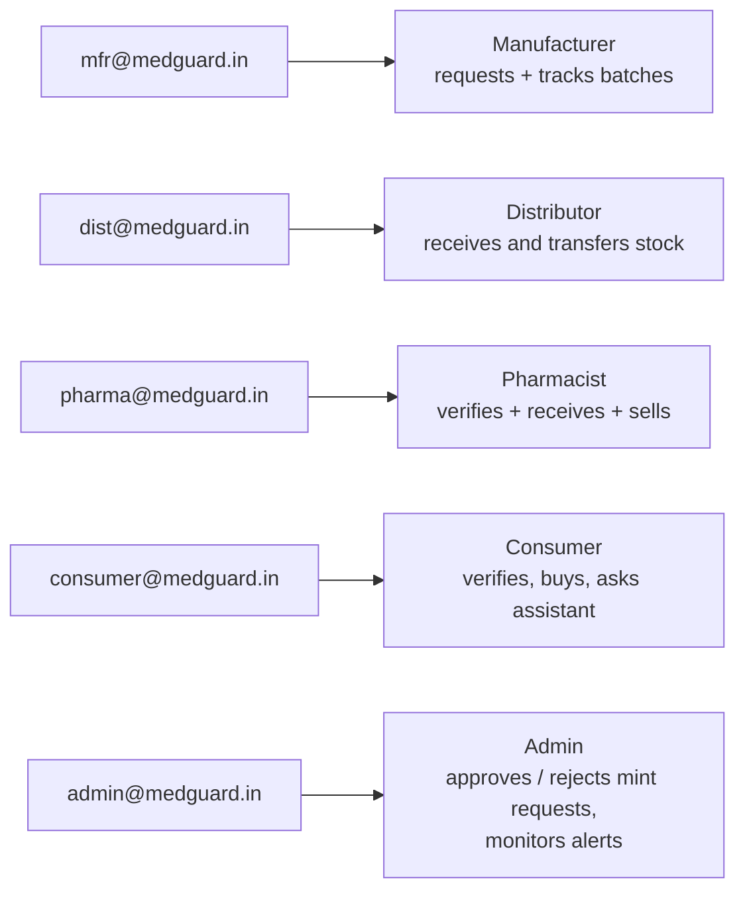

| Role         | Email                  | Home route      |
| ------------ | ---------------------- | --------------- |
| Manufacturer | `mfr@medguard.in`      | `/manufacturer` |
| Distributor  | `dist@medguard.in`     | `/distributor`  |
| Pharmacist   | `pharma@medguard.in`   | `/pharmacist`   |
| Consumer     | `consumer@medguard.in` | `/consumer`     |
| Admin        | `admin@medguard.in`    | `/admin`        |

The seed script also pre-approves one batch of 5 Paracetamol 500mg packs (`ACTIVE`) so the distributor → pharmacist → consumer demo works immediately without the admin step.

---

# Typical Verification Outcomes

## 1. Legitimate Medicine

```text
QR scanned
    ↓
Valid format
    ↓
Serial minted
    ↓
Signature valid
    ↓
Custody chain intact
    ↓
Valid state
    ↓
Normal scan behaviour

🟢 GENUINE
```

---

## 2. Never-Minted Counterfeit

```text
QR scanned
    ↓
Format valid
    ↓
Serial lookup

✗ Serial not found

🔴 COUNTERFEIT — not_minted
```

---

## 3. Forged QR

```text
QR scanned
    ↓
Serial appears valid
    ↓
Signature verification

✗ Invalid signature

🔴 COUNTERFEIT — bad_signature
```

---

## 4. Broken Supply Chain

```text
Manufacturer
      │
      └───────────────┐
                      ▼
                  Pharmacy

Expected legitimate custody node missing

✗ Custody chain invalid

🔴 COUNTERFEIT / BLOCKED — chain_broken
```

---

## 5. Possible QR Clone

```text
Genuine package
      ↓
Valid QR copied
      ↓
Multiple packages carry same identity
      ↓
Identity scans abnormally
      ↓
⚠ scan_flood
or
⚠ route_mismatch
or
⚠ scanned_after_sold

🟡 SUSPICIOUS — investigation recommended
```

---

# Project Structure

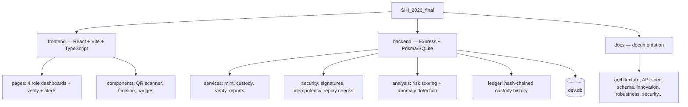

The system is organized around the following major responsibilities:

### Frontend

```text
React + Vite + TypeScript
```

Includes:

* role-specific dashboards,
* QR scanning,
* medicine verification,
* custody and journey timelines,
* status and trust badges,
* alerts,
* and verification feedback.

### Backend

```text
Node.js + Express
Prisma + SQLite
```

Responsible for:

* authentication and authorization,
* medicine minting,
* QR identity generation,
* custody transitions,
* verification,
* ledger operations,
* reports,
* anomaly detection,
* and security validation.

### Ledger

The ledger maintains the medicine's tamper-evident event history.

Events include actions such as:

```text
MINT
RECEIVE
SELL
BLOCK
```

Each event is associated with the appropriate identity, custody, transition, and integrity information.

### Security and Trust Layer

Responsible for mechanisms such as:

```text
QR format validation
Serial verification
Cryptographic signatures
Hash-chain verification
Authorization
State-machine validation
Idempotency
Replay protection
Scan analysis
Route/context checks
Risk scoring
Anomaly detection
Ledger self-checking
```

---

# Technology Stack

| Layer                   | Technology                             |
| ----------------------- | -------------------------------------- |
| Frontend                | React                                  |
| Language                | TypeScript                             |
| Build Tool              | Vite                                   |
| Backend                 | Node.js + Express                      |
| Database                | SQLite                                 |
| ORM                     | Prisma                                 |
| Authentication          | JWT                                    |
| Password Security       | bcrypt                                 |
| Cryptography            | `node:crypto`                          |
| QR Security             | Signed QR identities                   |
| Signature Support       | Ed25519 / legacy HMAC                  |
| HTTP Security           | Helmet                                 |
| Cross-Origin Protection | CORS                                   |
| Abuse Protection        | Rate limiting                          |
| Ledger                  | Append-only, tamper-evident hash chain |

---

# Design Priorities

ORVYN prioritizes:

```text
Authenticity
    +
Traceability
    +
Tamper Evidence
    +
Valid Custody
    +
Context Awareness
    +
Anomaly Detection
    +
Explainable Security
```

The system deliberately avoids depending on security buzzwords alone.

Each mechanism is intended to solve a specific problem:

| Mechanism            | Problem Addressed                                             |
| -------------------- | ------------------------------------------------------------- |
| Signed QR            | Prevents arbitrary identity forgery                           |
| Mint records         | Detects identities never issued by an authorized manufacturer |
| Hash-linked events   | Makes historical modification detectable                      |
| State machine        | Prevents arbitrary supply-chain jumps                         |
| Authorization        | Prevents unauthorized custody actions                         |
| Idempotency          | Prevents duplicate event creation                             |
| Replay validation    | Reduces repeated request abuse                                |
| Scan flood detection | Helps identify copied identity abuse                          |
| Route mismatch       | Detects contextual inconsistencies                            |
| Post-sale checks     | Detects unexpected identity reuse                             |
| Risk scoring         | Combines explainable anomaly signals                          |
| Self-check           | Verifies ledger integrity                                     |

---

# Documentation

Full documentation lives in [`docs/`](docs/).

Recommended starting points:

* [`docs/architecture.md`](docs/architecture.md) — overall system architecture.
* [`docs/innovation.md`](docs/innovation.md) — project innovation and pitch.
* [`docs/presentation/demo-script.md`](docs/presentation/demo-script.md) — walkthrough and demonstration flow.
* [`docs/robustness.md`](docs/robustness.md) — handling dropped networks, retries, and tampered chains.

Additional security and trust documentation covers:

* signed medicine identities,
* custody validation,
* hash-chain integrity,
* duplicate and replay protection,
* QR cloning and anomaly detection,
* contextual verification,
* and risk-based suspicious activity analysis.

---

# ORVYN in One Sentence

> **ORVYN is a context-aware pharmaceutical trust system that verifies not only whether a medicine's digital identity is genuine, but whether its cryptographic integrity, custody history, state transitions, and real-world behaviour collectively support the authenticity of the physical medicine package.**
