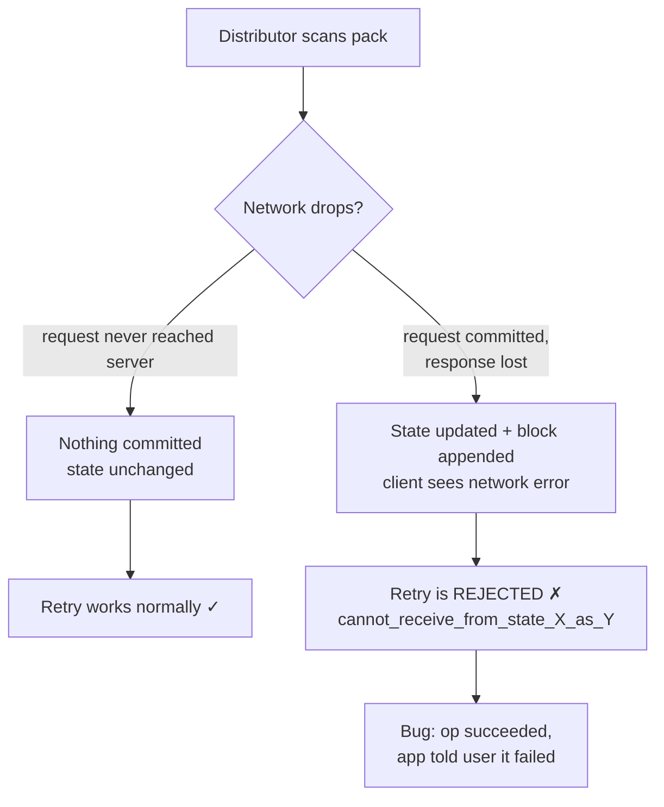
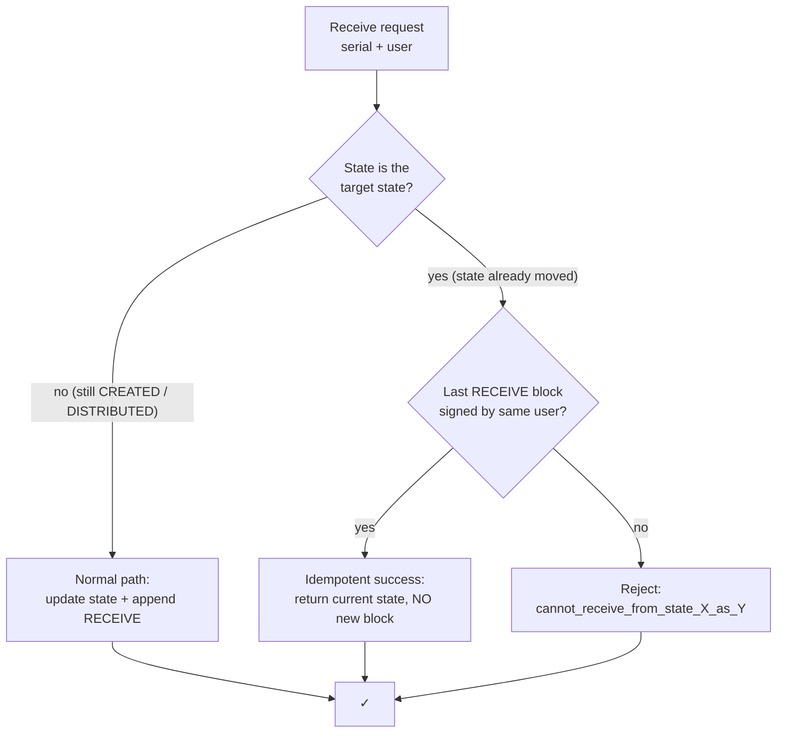
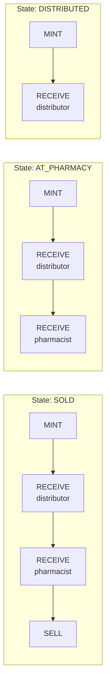
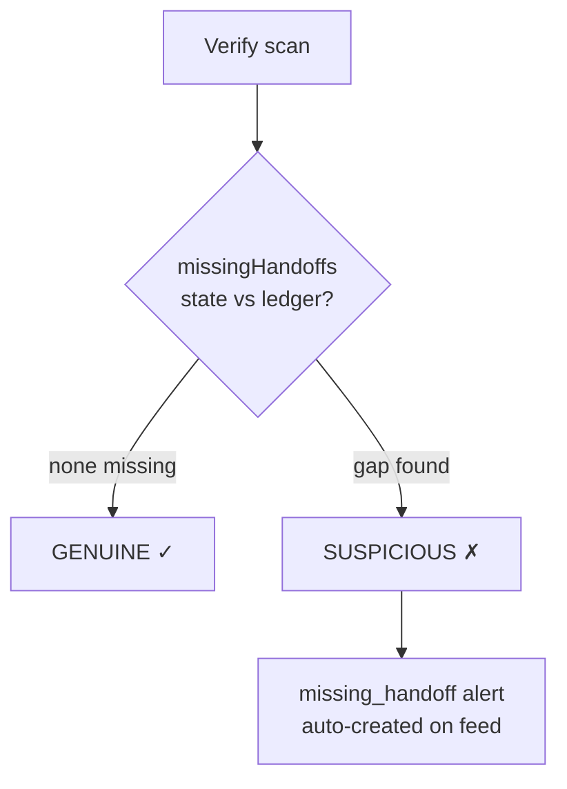

# Robustness: Network Resilience & Integrity Checks

Captures the design discussions around making the demo *not* fail under real-world
conditions: dropped networks and tampered chains.

## 1. Network failure on scan (idempotent retries)

### The scenario

A distributor (or pharmacist) scans a pack, the network drops mid-operation, and they
scan again. This is **not one problem, it's two:**



| Case | What actually happened | Retry outcome |
|---|---|---|
| Request never reached the server | Nothing was committed | Works fine — nothing to reject |
| Request reached the server, was committed, **response was lost** | State updated + block appended, client saw "network error" | **Rejected** — `cannot_receive_from_state_X_as_Y` |

Only case 2 is a bug: the operation *succeeded* but the app told the user it failed,
and the retry is then rejected because the state already moved.

### The fix — make receive/sell idempotent

In `backend/src/services/custody.ts`, when the normal state check fails we first ask:
*"did THIS same user already perform this exact step?"* If yes → return success
(the current state), instead of throwing.



```ts
// receiveProduct
} else {
  const target = user.role === "distributor" ? "DISTRIBUTED"
               : user.role === "pharmacist" ? "AT_PHARMACY" : null;
  if (target && product.state === target) {
    const last = await db.custodyRecord.findFirst({
      where: { productId: product.id, action: ACTIONS.RECEIVE },
      orderBy: { index: "desc" },
    });
    if (last?.signer === user.id) return { ...product, state: product.state };
  }
  throw new Error(`cannot_receive_from_state_${product.state}_as_${user.role}`);
}

// sellProduct — same pattern: if state === "SOLD" and last SELL block
// was signed by this pharmacist, return success instead of throwing.
```

Why this is safe, not just "loose":
- **`signer === user.id` is the key guard.** It distinguishes a *retry* (same user who
  performed the step) from a *genuine conflict* (a different distributor trying to
  grab a pack someone else already took — still rejected).
- It returns **before** `appendBlock`, so no duplicate block is ever written.
- Returns the **same response shape** as a first-time success, so the frontend needs
  zero changes.

Verified live (7 checks): first receive → `DISTRIBUTED`; same-user retry → `DISTRIBUTED`
(success); different-user retry → still rejected; full journey stays exactly
`MINT,RECEIVE,RECEIVE,SELL` — no duplicate blocks.

### Deliberately skipped

- **Offline queue on the phone** (queue scans locally, sync later) — the industrial
  solution, but heavy and wrong for an offline hackathon demo. Idempotency covers the
  real failure mode in ~10 lines.
- **`X-Idempotency-Key` header / new DB column** — redundant here: each step can only
  ever be legitimately done by one user, and the "same signer + same target state"
  check already proves retry-vs-conflict without a key.

### Known caveat (accepted)

The **verify** endpoint is public and writes a `ScanEvent` per call. A retry after a
network error writes a duplicate scan event, which can slowly inflate the `scan_flood`
counter. Impact is low (threshold is 3+ scans). Fix if it ever matters: pass a
`requestId` in the verify body and dedupe.

## 2. Missing hand-off detection (defense in depth)

### Why it exists

The server-side state machine (`CREATED → DISTRIBUTED → AT_PHARMACY → SOLD`) *prevents*
wrong-order receives in normal operation. But that rule lives in application memory —
it cannot tell whether the **stored ledger** is consistent with the claimed state. If
state is tampered with or bypassed directly in the database, the app logic would be
none the wiser.

### The fix — check the ledger on every verification

`backend/src/blockchain/ledger-core.ts` — `missingHandoffs(state, actions)`:



| State | Required evidence in the ledger |
|---|---|
| `DISTRIBUTED` | ≥ 1 `RECEIVE` (distributor hand-off) |
| `AT_PHARMACY` / `SOLD` | ≥ 2 `RECEIVE`s (distributor + pharmacist) |
| `SOLD` | must also contain a `SELL` record |

`backend/src/services/verify.ts` calls it on every scan; any gap raises the
`missing_handoff` flag → product becomes `SUSPICIOUS` → alert auto-created on the feed.



So a pack whose chain lacks the mandatory hand-offs can **never** be confirmed genuine,
regardless of how the records got into that state.

### Tests

`ledger-core.selfcheck.ts` asserts 5 cases (full chain → none missing; `AT_PHARMACY`
with one receive → missing pharmacist; `SOLD` without sale → missing sale; `CREATED`
with mint → none; `DISTRIBUTED` with only mint → missing distributor). Run:

```bash
npm run selfcheck
```

### Possible tightening (not done)

`missingHandoffs` counts `RECEIVE` blocks, not *who* performed them. If we ever want
"the two receives must be one distributor + one pharmacist specifically", the role is
already in each block's payload — an easy upgrade.
